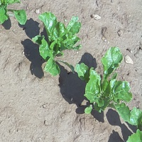
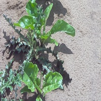
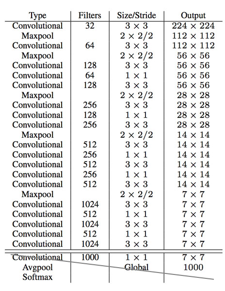
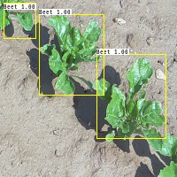
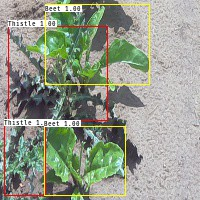
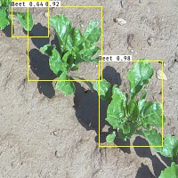
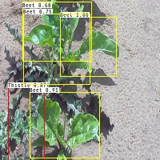

# Object Detection using You Only Look Once (YOLO) algorithm


**Credits**: A large portion in module [yolo_utils](./src/yolo_utils.py) is derived/adapted from this [source](https://github.com/HeroKillerEver/coursera-deep-learning). 


### Description
---

 * To detect two different types of plants in a given image namely `Beet` and `Thistle`  as show here: 

|  |  | 
|:--:| :--: |
| *Figure 1. Beets* | *Figure 2. Beets vs Thistle* |

 * In the `Figure 1` there are only plants of Beets but in the other figure, there are also Thistle, which is more important to detect for our objective of weeding them out from the field. 

* To detect these objects in such images- we can use [YOLO](https://arxiv.org/abs/1506.02640) which is not only fast but also has improved over time compared to other segmentation methods such [Mask RCNN](https://arxiv.org/abs/1703.06870). It is important to try all the algorithm and see which one best serves our need. For this project, the YOLO algorithm has been attempted. 

### Prerequisite
---

#### Dependency

Execute $ `pip install -r requirements.txt` to install all the dependency.  
  

#### Bounding box-generation

 * For any machine learning algorithm the prerequisite is data. It is the data from which algorithms learn and in supervised learning, we need target data as well. In this problem, we only have images thus need to generate the bounding boxes for these two class of objects here.  

 * We use a third party ([source](./draw_box/README.md)) module and make changes to adapt for our need. 


### Architecture
---

* As indicated that we will be using YOLO architecture for solving this problem. Since its first appearance in [2015](https://arxiv.org/abs/1506.02640) it has evolved over time and is more complex and resource-intensive but performance-wise is much better; like detecting overlapping objects, smaller, bigger, different dimensions etc.

* For our problem, we will use an early version of architecture inspired from [darknet](https://medium.com/@jonathan_hui/real-time-object-detection-with-yolo-yolov2-28b1b93e2088) architecture of YOLO to fit our need as shown below: 

||
|:--:|
|Figure 3. In our adaptation, we reduce the depth of CNN layers and the last fully-connected layer is replaced with a fully convolutional layer according to the number of channels needed in the output. |


* We start with input dimension of (256 x 256) which are max pooled six times to reduce to grid size of (4 x 4), which seem appropriate enough for the given data (as some of the images maximum of 6-7 objects), however, typically there are finer grid as well with other sizes of grids to detect object of different dimensions that gives better accuracy.     

* The last Fully CNN layer has 7 (1 + 4 + 2) channel output for our problem- 1 for confidence, 4 for coordinates and 2 for two classes (Beet vs Thistle).  


### Loss Function
---
<!-- for latex use https://www.codecogs.com/latex/eqneditor.php -->

 * To compute loss it is important to know how is target prepared from the knowledge of bounding box and class.
 
 * Out seven channels- first channel indicates object vs no-object for which loss (`conf_loss`) is computed using `Cross Entropy` loss function ans is given by  <!-- $- \Sigma [ y  \cdot \log \sigma (\hat{y})  +  (1-y) \cdot \log \sigma (1 - \hat{y})  ]$ -->.

 
 * The coordinates-loss for four points which are coordinates of top-left (`x1, y1`) and bottom-right (`x2, y2`) corners of the box is computed on values derived from these are 

   * First- the difference between object-center from cell-center, where difference is computed using scale of `tanh` since its range lies in [-1, 1] thus a left/right (x-ordinate) shift (delta) can be measured on the scale of half the width of cell using  <!-- $tanh^{-1} ((cx_{obj} - cx_{cell}) \cdot (2 / w_{cell}))$ --> and similarly for top/bottom (y-ordnate) is computed. Given the value of delta x and y one can compute the predicted x using  <!-- $cx_{cell} + (w_{cell} / 2) \cdot tanh(cx_{delta})$ --> and similary for y.

   * Second- the scale of widht and height of object is computed w.r.t. to image width and height using `sigmoid` since the range is in [0, 1] thus restricting the inferred object width and height within the size of image. And for this the scale (delta) value is given by  <!-- $-(\log((w_{model} / w_{obj}) - 1))$ --> for width and similar computation for height as well. While during inference;  using predicted delta width or height the objec inferred width is computed using   and similar process for the height.     

   * Hence, to compute coordinates-loss use sum of square different here since the `sigmoid` and `tanh` keep the value in a range to scale or shift respectively for center and width and height 

 * Third part of the target is class labels. While our problem is for binary class but the problem can be of any number of labels. However, the loss computed for this part is not like a multiclass problem, rather it is treated as a multilabel task where each class has a separate probability prediction unit to claim its type. The final winner for the type of object is a combination of confidence and class score. So, the loss for this part is multi-label where for each label computes its loss with binary cross-entropy function. 

 * `Note:` The losses computed does is not reduced to mean because doing that will make an image with ten objects have the same impact compared to image with one object, thus average is not taken.   


### Training
---

   The training of the network is like any other network. There exist many optimized ways to train a deep neural network (DNN) from using [ADAM](https://arxiv.org/abs/1412.6980) optimizer for finding descent direction to [one-cycle policy](https://arxiv.org/abs/1803.09820) for better learning rate, or [stochastic weight averaging](https://pytorch.org/blog/stochastic-weight-averaging-in-pytorch/) to improve generalization of the model. These techniques greatly help in improving performance and produce a robust model. We also use `L2` regularization to further avoid overfitting of the model.   

   * The data is split into three parts for training, validation and testing for training, hyperparameter optimization, evaluation. 


### Inference
---

 * From the project directory **execute** $```python ./src/predictor.py -h``` seek help on the type of argument needed to execute inference. Please note here that, although all the arguments that can be passed are optional for inference, however, for a new dataset provide fullpath to where the test data is stored and also the path for where the results should be saved.

 ```
Provide arguments for fullpath to directory where **Test** files are located
and fullpath to where **Results** will be saved and also indicate if data has
target value to generate the report.

optional arguments:
  -h, --help            show this help message and exit
  -t TEST, --test TEST  Provide fullpath to where the test images are stored.
  -r RESULTSPATH, --resultspath RESULTSPATH Provide fullpath to where results should be stored
  --has_target HAS_TARGET Indicates if the test data has the target (bool).
 ``` 

 * Ideal `true` results should look like the following images:

|  |  | 
|:--:| :--: |
| *Figure 4. Beets* | *Figure 5. Beets vs Thistle* |

* The trained model produced following results from the `optimized trained model`:

|  |  | 
|:--:| :--: |
| *Figure 6. Beets* | *Figure 7. Beets vs Thistle* |	

### Conclusion
---

Our objective here is to detect different types (`Beet vs Thistle`) of plants in such images. Despite having a limited amount (approx. 500 images) of data the optimised training model produced promising results. With this evidence, we can further dive deeper into this algorithm and try different techniques to further improve the results (listed in the future section) besides obtaining more data which always helps.  


### Future Works 
---

 * Use data augmentation for further improve the model.


 * Extend for multiple anchors per cell for better results.


 * Use [transfer learning](https://pytorch.org/tutorials/beginner/transfer_learning_tutorial.html) from [pre-trained](https://pytorch.org/docs/stable/torchvision/models.html) networks to further improve performance especially when the amount of data is low. 

